## Preliminary data analysis

## I. Authorship data: gender


``` r
# First load data: Corpus_Short
load(here(dir$raw.data,"Corpus_Short.Rdata"))

#10% of the original data : Corupus.Short.Small
Corpus.Short.Small <- Corpus.Short %>% 
  slice_sample(n = 60000)
```

### Step 1: Creation of new columns for each author and for each article

Separation of the column "AF" into several columns.
New columns are entitled "author\_" and goes from 1 to 15 (1 if there is only 1 author and 15 if there are 15 authors).
We thus discard of the analysis paper with more than 15 authors.


``` r
# Creation of a new column "nb_authors" to count the number of authors per article

Corpus.Short$nb_authors <- str_count(Corpus.Short$AF, ";") + 1 #for the original data base
Corpus.Short.Small$nb_authors <- str_count(Corpus.Short.Small$AF, ";") + 1 #for the reduced data base

# Display the 1000 largest values in the "nb_authors" column to see the maximum number of authors in the database. There are roughly 1500 articles that have more than 10 authors (0.2 % of the total so not very important).

top_1000_max_authors <- head(sort(Corpus.Short$nb_authors, decreasing = TRUE), 1000)
print(top_1000_max_authors)
```

```
##    [1] 281  93  74  72  66  61  59  52  51  49  49  47  47  47  46  46  45  44
##   [19]  43  42  41  40  40  38  36  36  36  36  35  35  35  34  34  34  33  33
##   [37]  33  33  33  33  33  33  33  32  32  31  31  31  30  30  30  30  29  29
##   [55]  29  28  28  28  28  28  28  28  27  27  27  27  27  27  27  27  27  27
##   [73]  27  27  26  26  26  26  26  26  26  26  26  25  25  25  25  25  25  25
##   [91]  25  25  25  25  25  24  24  24  24  24  24  24  24  24  24  24  24  24
##  [109]  24  24  24  24  24  24  24  24  24  23  23  23  23  23  23  23  23  23
##  [127]  23  23  23  23  23  23  23  22  22  22  22  22  22  22  22  22  22  22
##  [145]  22  22  22  22  22  22  21  21  21  21  21  21  21  21  21  21  21  21
##  [163]  21  21  20  20  20  20  20  20  20  20  20  20  20  20  20  20  20  20
##  [181]  20  20  20  20  20  20  20  20  20  20  20  20  20  20  19  19  19  19
##  [199]  19  19  19  19  19  19  19  19  19  19  19  19  19  19  19  19  19  19
##  [217]  19  19  19  19  19  19  19  19  18  18  18  18  18  18  18  18  18  18
##  [235]  18  18  18  18  18  18  18  18  18  18  18  18  18  18  18  18  18  18
##  [253]  18  18  18  18  18  18  18  18  18  18  18  18  18  18  18  18  17  17
##  [271]  17  17  17  17  17  17  17  17  17  17  17  17  17  17  17  17  17  17
##  [289]  17  17  17  17  17  17  17  17  17  17  17  17  17  17  17  17  17  17
##  [307]  17  17  17  17  17  17  17  17  17  17  17  17  17  17  17  17  17  17
##  [325]  17  17  17  17  17  16  16  16  16  16  16  16  16  16  16  16  16  16
##  [343]  16  16  16  16  16  16  16  16  16  16  16  16  16  16  16  16  16  16
##  [361]  16  16  16  16  16  16  16  16  16  16  16  16  16  16  16  16  16  16
##  [379]  16  16  16  16  16  16  16  16  16  16  16  16  16  16  16  16  15  15
##  [397]  15  15  15  15  15  15  15  15  15  15  15  15  15  15  15  15  15  15
##  [415]  15  15  15  15  15  15  15  15  15  15  15  15  15  15  15  15  15  15
##  [433]  15  15  15  15  15  15  15  15  15  15  15  15  15  15  15  15  15  15
##  [451]  15  15  15  15  15  15  15  15  15  15  15  15  15  15  15  15  15  15
##  [469]  15  15  15  15  15  15  15  15  15  15  15  15  15  15  15  15  15  15
##  [487]  15  15  15  15  15  15  15  15  15  15  15  15  15  15  15  15  15  15
##  [505]  15  15  15  14  14  14  14  14  14  14  14  14  14  14  14  14  14  14
##  [523]  14  14  14  14  14  14  14  14  14  14  14  14  14  14  14  14  14  14
##  [541]  14  14  14  14  14  14  14  14  14  14  14  14  14  14  14  14  14  14
##  [559]  14  14  14  14  14  14  14  14  14  14  14  14  14  14  14  14  14  14
##  [577]  14  14  14  14  14  14  14  14  14  14  14  14  14  14  14  14  14  14
##  [595]  14  14  14  14  14  14  14  14  14  14  14  14  14  14  14  14  14  14
##  [613]  14  14  14  14  14  14  14  14  14  14  14  14  14  14  14  14  14  14
##  [631]  14  14  14  14  14  14  14  14  14  14  14  13  13  13  13  13  13  13
##  [649]  13  13  13  13  13  13  13  13  13  13  13  13  13  13  13  13  13  13
##  [667]  13  13  13  13  13  13  13  13  13  13  13  13  13  13  13  13  13  13
##  [685]  13  13  13  13  13  13  13  13  13  13  13  13  13  13  13  13  13  13
##  [703]  13  13  13  13  13  13  13  13  13  13  13  13  13  13  13  13  13  13
##  [721]  13  13  13  13  13  13  13  13  13  13  13  13  13  13  13  13  13  13
##  [739]  13  13  13  13  13  13  13  13  13  13  13  13  13  13  13  13  13  13
##  [757]  13  13  13  13  13  13  13  13  13  13  13  13  13  13  13  13  13  13
##  [775]  13  13  13  13  13  13  13  13  13  13  13  13  13  13  13  13  13  13
##  [793]  13  13  13  13  13  13  13  13  13  13  13  13  13  13  13  13  13  13
##  [811]  13  13  13  13  13  13  13  13  13  13  13  13  13  13  13  13  13  13
##  [829]  13  13  13  13  13  13  13  13  13  13  13  13  13  13  13  13  13  13
##  [847]  13  13  13  13  13  13  13  13  13  13  13  13  13  13  13  13  13  13
##  [865]  13  13  13  13  13  13  13  13  13  13  13  13  13  13  13  13  13  13
##  [883]  13  13  13  13  13  13  13  13  13  13  13  13  13  13  13  13  13  13
##  [901]  13  13  13  13  12  12  12  12  12  12  12  12  12  12  12  12  12  12
##  [919]  12  12  12  12  12  12  12  12  12  12  12  12  12  12  12  12  12  12
##  [937]  12  12  12  12  12  12  12  12  12  12  12  12  12  12  12  12  12  12
##  [955]  12  12  12  12  12  12  12  12  12  12  12  12  12  12  12  12  12  12
##  [973]  12  12  12  12  12  12  12  12  12  12  12  12  12  12  12  12  12  12
##  [991]  12  12  12  12  12  12  12  12  12  12
```

``` r
# Or alternatively:
table(Corpus.Short$nb_authors) # Number of articles by number of authors
```

```
## 
##      1      2      3      4      5      6      7      8      9     10     11 
## 172171 186621 138439  61243  24263  11009   5310   2986   1796   1115    655 
##     12     13     14     15     16     17     18     19     20     21     22 
##    440    263    134    113     65     61     44     30     30     14     17 
##     23     24     25     26     27     28     29     30     31     32     33 
##     16     22     12      9     12      7      3      4      3      2      9 
##     34     35     36     38     40     41     42     43     44     45     46 
##      3      3      4      1      2      1      1      1      1      1      2 
##     47     49     51     52     59     61     66     72     74     93    281 
##      3      2      1      1      1      1      1      1      1      1      1
```

``` r
hist(Corpus.Short$nb_authors, breaks = 281) # Same thing but as a histogram
```

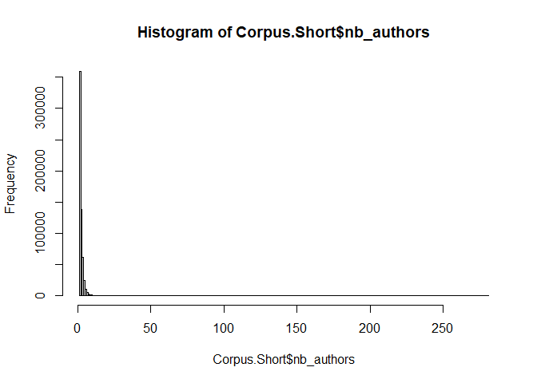<!-- -->

``` r
sum(table(Corpus.Short$nb_authors)[1:15])/length(Corpus.Short$nb_authors) # Let's focus on articles with maximum 15 authors as this accounts for 99,95% of articles
```

```
## [1] 0.9993509
```

``` r
# Creation of the columns for the authors : each column correspond to an additional author for each article (author_1 if 1 author and author_15 if 15 authors, with one author per column). There are 603 838 missing values due to the fact that 172 171 articles have only 1 author. 

Corpus.Short.Small.Filt <- Corpus.Short.Small %>%
  filter(nb_authors < 16) %>% # Only keep articles with 15 authors at max (99.95% of the corpus)
  separate(col = AF, into = paste0("author_", 1:15), sep = ";", remove = FALSE, extra = "warn") # I've just changed the extra argument with "warn", to check if there are any mistakes
```

```
## Warning: Expected 15 pieces. Missing pieces filled with `NA` in 59941 rows [1, 2, 3, 4,
## 5, 6, 7, 8, 9, 10, 11, 12, 13, 14, 15, 16, 17, 18, 19, 20, ...].
```

``` r
# Just to check the number of articles with exactly 15 authors (code below is commented, but possible to check)
# Corpus.Short.Small.Filt %>% 
#   filter(nb_authors == 15) %>% 
#   dim() 

# Last check: number of articles by authors, but using the random sample of 60 000 articles:
table(Corpus.Short.Small.Filt$nb_authors)
```

```
## 
##     1     2     3     4     5     6     7     8     9    10    11    12    13 
## 17161 18395 13535  6059  2395  1146   556   274   145   116    62    49    35 
##    14    15 
##    13    15
```

Check to see if there are no missing values in one of the new column created : OK


``` r
results<- vector("logical", length = 15)

for (i in 1:15) {
  results[i] <- all(is.na(Corpus.Short.Small.Filt[[paste0("author_", i)]]))
}

print(results)
```

```
##  [1] FALSE FALSE FALSE FALSE FALSE FALSE FALSE FALSE FALSE FALSE FALSE FALSE
## [13] FALSE FALSE FALSE
```

### Step 2 : Create a column for each last name (l_name) and first name (f_name).
f_name will be used during all the analysis of the gender.


``` r
for (i in 1:15) {
  Corpus.Short.Small.Filt <- Corpus.Short.Small.Filt %>%
    separate(col = paste0("author_", i), into = c(paste0("l_name_", i), paste0("f_name_", i)), sep = ",", remove = FALSE, extra = "drop")
}
```

```
## Warning: Expected 2 pieces. Missing pieces filled with `NA` in 316 rows [118, 452, 576,
## 1081, 1095, 1720, 1867, 1921, 2037, 2129, 2179, 2217, 2752, 2892, 3427, 4115,
## 4216, 4368, 4744, 4785, ...].
```

```
## Warning: Expected 2 pieces. Missing pieces filled with `NA` in 207 rows [1095, 1173,
## 1253, 1720, 1867, 2007, 2217, 3129, 4115, 4163, 4216, 4716, 4744, 4785, 4836,
## 4867, 5018, 5038, 5505, 5788, ...].
```

```
## Warning: Expected 2 pieces. Missing pieces filled with `NA` in 148 rows [1, 242, 910,
## 1253, 1475, 1720, 1867, 2212, 2892, 3923, 4040, 4216, 4744, 4867, 6131, 7418,
## 7786, 8143, 8975, 9170, ...].
```

```
## Warning: Expected 2 pieces. Missing pieces filled with `NA` in 79 rows [1754, 1867,
## 2068, 2892, 4781, 4867, 6131, 6415, 10645, 10764, 10981, 11176, 11932, 12543,
## 12801, 13130, 13170, 15417, 15833, 17058, ...].
```

```
## Warning: Expected 2 pieces. Missing pieces filled with `NA` in 46 rows [6131, 8330,
## 8436, 10645, 11932, 12801, 15833, 15886, 17058, 17265, 17666, 18148, 18209,
## 18830, 19121, 19846, 19858, 19953, 20809, 21941, ...].
```

```
## Warning: Expected 2 pieces. Missing pieces filled with `NA` in 31 rows [8436, 10645,
## 11932, 12801, 15833, 15886, 17058, 17265, 17666, 18209, 18830, 19058, 19846,
## 19858, 19953, 21941, 22312, 24467, 28279, 30444, ...].
```

```
## Warning: Expected 2 pieces. Missing pieces filled with `NA` in 2 rows [18209,
## 43629].
```

```
## Warning: Expected 2 pieces. Missing pieces filled with `NA` in 3 rows [18209, 50849,
## 56094].
```

```
## Warning: Expected 2 pieces. Missing pieces filled with `NA` in 3 rows [18209, 20281,
## 50849].
```

```
## Warning: Expected 2 pieces. Missing pieces filled with `NA` in 1 rows [50849].
## Expected 2 pieces. Missing pieces filled with `NA` in 1 rows [50849].
```

The warning message signals that some authors have no first name or last name.
Ideed some authors don't have first names, that we need to keep in mind in the rest of the analyis.
Two reasons for the absence of first name: some authors have no firstname in the data (they only mention one name, classified as last name, and no first name), and some authors have their names not separated with comma ",", thus not making possible to separate last name and first name.
This is a mistake from the raw data from the bibliographic database, that seems to occur not that much.
We can set this problem aside for the rest of the analysis.


``` r
# Check the case of an article with multiple missing authors (replace the number 27162 with one of the recurring number coming from the warning message in the preceding command)
Corpus.Short.Small.Filt %>% 
  slice(27162) %>% 
  select(matches("\\d$")) # To select columns whose name ends with a number (and therefore only view coluns such as f_name_i etc...)
```

```
##           author_1 l_name_1   f_name_1              author_2     l_name_2
## 1 Louis, Philippos    Louis  Philippos  Troumpounis, Orestis  Troumpounis
##   f_name_2         author_3 l_name_3 f_name_3             author_4  l_name_4
## 1  Orestis  Tsakas, Nikolas   Tsakas  Nikolas  Xefteris, Dimitrios  Xefteris
##     f_name_4 author_5 l_name_5 f_name_5 author_6 l_name_6 f_name_6 author_7
## 1  Dimitrios     <NA>     <NA>     <NA>     <NA>     <NA>     <NA>     <NA>
##   l_name_7 f_name_7 author_8 l_name_8 f_name_8 author_9 l_name_9 f_name_9
## 1     <NA>     <NA>     <NA>     <NA>     <NA>     <NA>     <NA>     <NA>
##   author_10 l_name_10 f_name_10 author_11 l_name_11 f_name_11 author_12
## 1      <NA>      <NA>      <NA>      <NA>      <NA>      <NA>      <NA>
##   l_name_12 f_name_12 author_13 l_name_13 f_name_13 author_14 l_name_14
## 1      <NA>      <NA>      <NA>      <NA>      <NA>      <NA>      <NA>
##   f_name_14 author_15 l_name_15 f_name_15 JEL1 Top25 Top10 Top30
## 1      <NA>      <NA>      <NA>      <NA> <NA>     0     0     0
##                                                                                                                                                                                                                                                                      C1
## 1 [Louis, Philippos; Tsakas, Nikolas; Xefteris, Dimitrios] Univ Cyprus, Dept Econ, POB 20537, CY-1678 Nicosia, Cyprus; [Troumpounis, Orestis] Univ Padua, Via Santo 33, I-35137 Padua, Italy; [Troumpounis, Orestis] Univ Lancaster, Management Sch, Lancaster, England
##   Z9 U1 U2                 J9 Q54
## 1  1  2  2 J ECON BEHAV ORGAN  NA
```

### Step 3 : Cleaning in two steps: - first step -\> removing spaces and uniformize character encoding of first names and last names to then generate a column "fullname_i" which is made of first name and last name.
This column will be the one used to match with the list of female economists (which is made of female economists full names) - second step -\> continue cleaning of the firstnames columns (remove special characters, punctuations and isolated letters).
This will give us first names columns that are cleaned and ready to be used with the gender command


``` r
Corpus.CleanedNames <- Corpus.Short.Small.Filt

for (i in 1:15) {
  print(i)
  # Supprimer les textes entre parenthèses :
  # Pour le prénom
  Corpus.CleanedNames[[paste0("f_name_", i)]] <- gsub(pattern = "\\s*\\([^\\)]+\\)",
                                                      replacement = "",
                                                      x = Corpus.CleanedNames[[paste0("f_name_", i)]])
  # Pour le nom
  Corpus.CleanedNames[[paste0("l_name_", i)]] <- gsub(pattern = "\\s*\\([^\\)]+\\)",
                                                      replacement = "",
                                                      x = Corpus.CleanedNames[[paste0("l_name_", i)]])  
  
  # Supprimer les espaces supplémentaires : 
  # Pour le prénom
  Corpus.CleanedNames[[paste0("f_name_", i)]] <- gsub(pattern = "\\s+",
                                                      replacement = " ",
                                                      x =  Corpus.CleanedNames[[paste0("f_name_", i)]])
  # Pour le nom
  Corpus.CleanedNames[[paste0("l_name_", i)]] <- gsub(pattern = "\\s+", 
                                                      replacement = " ",
                                                      x =  Corpus.CleanedNames[[paste0("l_name_", i)]])
  
  # Supprimer les espaces de début et de fin : 
  # Pour le prénom
  Corpus.CleanedNames[[paste0("f_name_", i)]] <- trimws(Corpus.CleanedNames[[paste0("f_name_", i)]])
  # Pour le nom
  Corpus.CleanedNames[[paste0("l_name_", i)]] <- trimws(Corpus.CleanedNames[[paste0("l_name_", i)]])
  
  # Remove all accents and uniformize character encoding
  Corpus.CleanedNames[[paste0("f_name_", i)]] <- stri_trans_general(Corpus.CleanedNames[[paste0("f_name_", i)]],
                                                                    "Latin-ASCII")
  Corpus.CleanedNames[[paste0("l_name_", i)]] <- stri_trans_general(Corpus.CleanedNames[[paste0("l_name_", i)]],
                                                                      "Latin-ASCII")
  
  # Créer une colonne fullname_i qui combine firstname et lastname avec un espace:
 
  Corpus.CleanedNames <- Corpus.CleanedNames %>% 
    mutate(!!paste0("fullname_", i) := ifelse(test = is.na(.[[paste0("f_name_", i)]]) & is.na(.[[paste0("l_name_", i)]]), 
                                              yes = NA,
                                              no = ifelse(
                                                test = is.na(.[[paste0("f_name_", i)]]),
                                                yes = .[[paste0("l_name_", i)]],
                                                no = ifelse(
                                                  test = is.na(.[[paste0("l_name_", i)]]), 
                                                  yes = .[[paste0("f_name_", i)]], 
                                                  no = paste(.[[paste0("f_name_", i)]],
                                                             .[[paste0("l_name_", i)]], 
                                                             sep = " ")
                                                )
                                              )
                                              )
           ) 


# Second step cleaning: nettoyer la colonne first name pour améliorer l'identification des prénoms avec la commande gender
# Supprimer les lettres suivies d’un point : 
  Corpus.CleanedNames[[paste0("f_name_", i)]] <- gsub(pattern = "[A-Za-z]\\.", 
                                                      replacement = "",
                                                      x =  Corpus.CleanedNames[[paste0("f_name_", i)]])
  
  # Remplacer les ponctuations par des espaces (exemple des noms composés) : 
  Corpus.CleanedNames[[paste0("f_name_", i)]] <- gsub(pattern = "[[:punct:]]", 
                                                      replacement = " ",
                                                      x = Corpus.CleanedNames[[paste0("f_name_", i)]])
  
  # Supprimer les espaces supplémentaires (double espaces potentiellement dûs au remplacement de la ponctuation par des espaces): 
  Corpus.CleanedNames[[paste0("f_name_", i)]] <- gsub(pattern = "\\s+",
                                                      replacement = " ",
                                                      x =  Corpus.CleanedNames[[paste0("f_name_", i)]])

  # Supprimer les espaces de début et de fin : 
  Corpus.CleanedNames[[paste0("f_name_", i)]] <- trimws(Corpus.CleanedNames[[paste0("f_name_", i)]])
  
  # If several first names only keep the first one:
  Corpus.CleanedNames[[paste0("f_name_", i)]] <- map_chr(.x = Corpus.CleanedNames[[paste0("f_name_", i)]],
                                                         .f =  ~ strsplit(.x, " ")[[1]][1])
  
  
  # Supprimer les espaces de début et de fin (à nouveau, au cas où la dernière opération en a introduit):
  Corpus.CleanedNames[[paste0("f_name_", i)]] <- trimws(Corpus.CleanedNames[[paste0("f_name_", i)]])

  
}
```

```
## [1] 1
## [1] 2
## [1] 3
## [1] 4
## [1] 5
## [1] 6
## [1] 7
## [1] 8
## [1] 9
## [1] 10
## [1] 11
## [1] 12
## [1] 13
## [1] 14
## [1] 15
```

``` r
# Check how it looks like
check <- Corpus.CleanedNames %>% 
  slice(1:20) %>% 
  select(matches("\\d$"))
```

Jean-Paul devient Jean Paul, les parethèses et les chiffres sont supprimées ainsi que les lettres suivies d'un point.

## Step 4 : Dataframe for probabilities of gender according to first name

La méthode "ssa" utilise les noms de bébés de la US Census List des États-Unis.
Elle se restreint donc seulement aux EU.
La méthode "ipums" recherche les noms à partir des données du recensement américain Integrated Public Use Microdata Series.
La méthode "napp" utilise les microdonnées de recensement du Canada, de la Grande-Bretagne, du Danemark, de l'Islande, de la Norvège et de la Suède de 1801 à 1910 créées par le North Atlantic Population Project.
La méthode "kantrowitz" utilise le corpus Kantrowitz de noms masculins et féminins.
La méthode "genderize" utilise l'API Genderize.io <https://genderize.io/>, qui est basée sur les "profils d'utilisateurs des principaux réseaux sociaux".

En revanche, je ne sais pas comment le package traite les prénoms qu'il ne connait pas.
-\> A priori: Il renvoie une valeur manquante / pas de valeur.
Par exemple


``` r
  test1 = gender("Loic")
  test2 = gender("Jeanu")
```

Les différentes méthodes donnent bien des résultats différents.
Chaque méthode ont des listes de noms différents, et entre méthode, un même prénom peut avoir une probabilité de genre différente.

Nous démarrons par assigner le genre au prénom des auteurs avec la méthode ssa qui semble la plus adaptée pour notre corpus (car issue de données américaines relativement récente, et les Etats-Unis sont composés d'un nombre important de cultures/civilisations, augmentant ainsi l'ensemble de prénoms possibles).

Puis nous utiliserons la méthode "napp".


``` r
#Avec une seule méthode (ssa par défaut)

#Définition de la fonction
get_gender_prob_ssa <- function(names)
  
{
  gender(names, method = "ssa")
}

#Application de la fonction get_gender_prob aux colonnes de Corpus.Short qui commencent par f_name

gender_proba_ssa <- lapply(Corpus.CleanedNames[, grepl("^f_name_", colnames(Corpus.CleanedNames))], get_gender_prob_ssa)

#Combiner les résultats du code précédent en un seul dataframe, en les ajoutant lignes par lignes

gender_proba_ssa_df <- do.call(rbind, gender_proba_ssa)

#Garder les valeurs uniques

gender_proba_ssa_df_2 <- gender_proba_ssa_df %>%
  group_by(name) %>%
  slice(1)
```


``` r
# Je propose d'améliorer l'approche: récupérer les cas uniques de prénoms par l'approche nap non repéré par ssa pour augmenter la liste de prénoms

# D'abord avec la méthode napp qui a l'avantage d'ajouter un bon nombre de prénoms "nordiques"
get_gender_prob_napp <- function(names)
{
  gender(names, 
         method = c("napp"),
         countries = c("Canada", "United Kingdom", "Denmark", "Iceland","Norway", "Sweden")
         )
}

gender_proba_napp <- lapply(Corpus.CleanedNames[, grepl("^f_name_", colnames(Corpus.CleanedNames))], get_gender_prob_napp)

gender_proba_napp_df <- do.call(rbind, gender_proba_napp)

gender_proba_napp_df_2 <- gender_proba_napp_df %>%
  group_by(name) %>%
  slice(1) 

# Only keep names not in gender_proba_df_2 and add them:
gender_proba_napp_df_3 <- gender_proba_napp_df_2 %>%
  filter(!(name %in% gender_proba_ssa_df_2$name)) 

gender_proba_df <- gender_proba_ssa_df_2 %>% 
  bind_rows(gender_proba_napp_df_3) %>% # Add them to the first names from ssa and put that in a new object
  arrange(name)

# Puis tentative avec la méthode kantrowitz
get_gender_prob_kant <- function(names)
{
  gender(names, 
         method = "kantrowitz"
         )
}

# Suite méthode kantrowitz, pour voir les prénoms possiblement ajoutés mais abandon car long et peu de prénoms en plus
# Attention: la ligne de code suivante prend une 10aine de minutes et ne rajoute qu'une 20 aine de prénoms que nous n'avons pas déjà. Ce n'est donc pas nécessaire de la faire 
# gender_proba_kant <- lapply(Corpus.CleanedNames[, grepl("^f_name_", colnames(Corpus.CleanedNames))], get_gender_prob_kant)
# 
# gender_proba_df_kant <- do.call(rbind, gender_proba_kant)
# 
# gender_proba_df_kant <- gender_proba_df_kant %>%
#   group_by(name) %>%
#   slice(1) 
# 
# gender_proba_df_6 <- gender_proba_df_kant %>%
#   filter(!(name %in% gender_proba_df$name), !is.na(gender), gender %in% c("male","female")) %>% 
#   mutate(proportion_male = ifelse(gender == "male", 1.0000, 0.0000),
#          proportion_female = ifelse(gender != "male", 1.0000, 0.0000))

# Objet final: tous les prénoms et leur proba de genre:
names_proba_df <- gender_proba_df 
# %>% 
#   bind_rows(gender_proba_df_6) %>% 
#   arrange(name)
```

Problème corrigé: On a maintenant un annuaire de 10400 prénoms environ.
Avant de faire l'algorithme d'appariement du genre au prénom, nous pouvons regarder la quantité de prénoms d'auteurs déifférents dans le corpus.
Et la comparer à nos 10400 prénoms différents.


``` r
all_names_incorpus <- unlist(Corpus.CleanedNames[, grepl("^f_name_", colnames(Corpus.CleanedNames))]) %>% 
  unique() # Vecteur qui contient tous les prénoms différents dans le corpus
length(all_names_incorpus)
```

```
## [1] 27347
```

Environ 27300 prénoms.
Nous avons donc un peu plus d'1/3 des prénoms dont nous pouvons déterminer le genre à partir des méthodes SSA et NAPP, et 2/3 qui ne seront pas reconnus par cette méthode.
Quels sont les noms que nous ne pourrons pas apparier, et combien y-en-a-t-il?


``` r
unmatched_names <- all_names_incorpus[!(all_names_incorpus %in% names_proba_df$name)]
length(unmatched_names)
```

```
## [1] 17014
```

``` r
unmatched_names[1:100]
```

```
##   [1] "Jiangtao"     NA             "Ick"          "Zongrun"      "Guangyuan"   
##   [6] "Lamyae"       "Wenbiao"      "Jiang"        "Jomon"        "Nobuhito"    
##  [11] "Hongqi"       "Branimir"     "Akmaral"      "Golo"         "Rong"        
##  [16] "Surajeet"     "Serhan"       "Sasidaran"    "Saumitra"     "Chalapati"   
##  [21] "Sundar"       "Hsiang"       "Navprit"      "Nazura"       "Xiaoyan"     
##  [26] "Susmita"      "Makram"       "Sugata"       "Mihaly"       "Putu"        
##  [31] "Minqi"        "Andelka"      "Mirwanee"     "Wajih"        "Ramokhojoane"
##  [36] "Weihua"       "Soocheol"     "Seyi"         "Peyman"       "Hoon"        
##  [41] "Sousna"       "Normaliza"    "Kanyarat"     "Penporn"      "Xiaobo"      
##  [46] "Sungjin"      "Jayendra"     "Eiskje"       "Mo"           "Sutti"       
##  [51] "Subbu"        "Antoaneta"    "Arghyadeep"   "Bidisha"      "Huubinh"     
##  [56] "Yonghong"     "Yujie"        "Carmenza"     "Nazima"       "Yoyok"       
##  [61] "Joerg"        "Haiying"      "Nataliia"     "Panchanan"    "Basu"        
##  [66] "Weiguo"       "Gemunu"       "Gunesh"       "Toshihiro"    "Thanassis"   
##  [71] "Seh"          "Abdelhakim"   "Hsuan"        "Xingtang"     "Zhuoqiong"   
##  [76] "Utku"         "Yanwei"       "Zubaria"      "Febriela"     "Yulan"       
##  [81] "Byomakesh"    "Gucheng"      "Vareska"      "Sovanbrata"   "Merijn"      
##  [86] "Surendra"     "Morakot"      "Xinru"        "Farnoosh"     "Tytti"       
##  [91] "Boqiang"      "Yuanqiong"    "Pritpal"      "Juthika"      "Lixin"       
##  [96] "Pragun"       "Shaibu"       "Huihua"       "Ahrum"        "Tadas"
```

Environ 17 000 prénoms que nous ne pourrons pas apparier.
Beaucoup de prénoms qui ne semblent pas être issues de culture occidentales.
Nous verrons plus tard qu'il s'agit aussi de prénoms très rare et qui reviennent peu régulièrement dans les articles.
Sur les 60000 articles, ces prénoms reviennent finalement peu de fois, ce qui affecte assez peu l'appariement.
En revanche, cela introduit un biais de sélection important: nous sommes incapable de genrer les auteurs avec des prénoms non occidentaux.

Dernière tentative d'augmenter la liste de prénoms et le genre associés.
La méthode genderize du package gender.
Est-il possible d'utiliser la méthode avec genderize?
Il s'agit d'un essai ci-dessous, mais cela ne fonctionne pas: le site genderize refuse la nombre trop grand de requêtes qu'il faudrait faire


``` r
get_gender_prob_genderize <- function(names)
{
  gender(names, 
         method = "genderize"
         )
}

# Initialize an empty vector to store the results
results <- tibble()

# Apply the function with a delay of 0.1 seconds between each application
for (i in 1:30) {
  print(i)
  result <- get_gender_prob_genderize(unmatched_names[i])
  results <- bind_rows(results, result)
  Sys.sleep(1)  # Pause for 0.01 seconds
}
```

```
## [1] 1
## [1] 2
## [1] 3
## [1] 4
## [1] 5
## [1] 6
## [1] 7
## [1] 8
## [1] 9
## [1] 10
## [1] 11
## [1] 12
## [1] 13
## [1] 14
## [1] 15
## [1] 16
## [1] 17
## [1] 18
## [1] 19
## [1] 20
## [1] 21
## [1] 22
## [1] 23
## [1] 24
## [1] 25
## [1] 26
## [1] 27
## [1] 28
## [1] 29
## [1] 30
```

L'API de genderize bloque après trop de requêtes.

## Step 5 : Creation of an algorithm to assign first names to gender

We assign gender to a name using the following algorith: 1.
Test If first name is missing (NA): If missing: no gender is assigned (NA) If not: 2.
test if first name is among the list of common chinese first names (for construction of `common_chinese_names`see Rscript) If first name present: gender is unknown If not present: 3.
test if the full name is in the list of the top10% of fermale economists If full name is present: gender is female If not present: 4.
test if first name is missing in the list of first name with gender probability (`names_proba_df$name`): If absent: no gender is assigned (NA) If not: assign gender according to probability threshold.
Rule is the following: If probability of a male first name is larger than 0.9, gender is male If probability of a male first name is smaller than 0.1, gender is female If probability of a male first name is between 0.1 and 0.9, then gender is unknown.

We code it as follows:


``` r
# Garder uniquement les colonnes qui nous intéressent dans le dataframe gender_proba_df_2
# Je propose de garder toutes les variables pour le moment
head(names_proba_df)
```

```
## # A tibble: 6 × 6
## # Groups:   name [6]
##   name      proportion_male proportion_female gender year_min year_max
##   <chr>               <dbl>             <dbl> <chr>     <dbl>    <dbl>
## 1 Aaditya                 1                 0 male       1932     2012
## 2 Aakanksha               0                 1 female     1932     2012
## 3 Aakash                  1                 0 male       1932     2012
## 4 Aalia                   0                 1 female     1932     2012
## 5 Aalok                   1                 0 male       1932     2012
## 6 Aamer                   1                 0 male       1932     2012
```

``` r
# Récupérer les noms des femmes économistes et des prénoms chinois communs
load(here(dir$prep.data, "FemaleEconomists_Names.Rdata"))
load(here(dir$prep.data, "Common_Chinese_Names.Rdata"))
load(here(dir$prep.data, "MaleEconomists_Names.Rdata"))

common_chinese_names <- common_chinese_names[common_chinese_names!="Juan"]

Corpus.CleanedNames.2 <- Corpus.CleanedNames
# Algorithm that create a gender variable. But it also adds for all authors their probability of male firstname, and their probability of female first name
for(i in 1:15) {
  print(i)
  Corpus.CleanedNames.2 <- Corpus.CleanedNames.2 %>%
    # First create variable gender (takes value: NA, unknown, male and female)
    mutate(
      !!paste0("gender_", i) := ifelse(
        test = is.na(.[[paste0("f_name_", i)]]), # 1. if first name is missing in Corpus.CleanedNames.2 gender = NA
        yes = NA,
        no = ifelse( 
          test = .[[paste0("f_name_", i)]] %in% common_chinese_names, # 2. if first name is in the list of common chinese first names gender = unknown
          yes = "unknown",
          no = ifelse(
            test = .[[paste0("fullname_", i)]] %in% top10_female_economists, # 3. If full name is in the list of top 10% of female economists gender = female
            yes = "female",
            no = ifelse(
              test = .[[paste0("fullname_", i)]] %in% top10_male_economists, # 4. If full name is in the list of top 10% of male economists gender = male
              yes = "male",
              no = ifelse(
                test = !(.[[paste0("f_name_", i)]] %in% names_proba_df$name), # 5. If first name is absent from the list of first names with measured gender probability (absent from names_proba_df) gender = NA
                yes = NA,
                no = case_when(
                  names_proba_df$proportion_male[match(.[[paste0("f_name_", i)]], names_proba_df$name)] > 0.9 ~ "male",
                  names_proba_df$proportion_male[match(.[[paste0("f_name_", i)]], names_proba_df$name)] < 0.1 ~ "female",
                  names_proba_df$proportion_male[match(.[[paste0("f_name_", i)]], names_proba_df$name)] >= 0.1 & names_proba_df$proportion_male[match(.[[paste0("f_name_", i)]], names_proba_df$name)] <= 0.9 ~ "unknown"
                )
              )
            )
          )
        )
      )
    ) %>%
    mutate(
      !!paste0("proportion_male_", i) := ifelse(
        test = is.na(.[[paste0("f_name_", i)]]), # Create the variable that gives the probability that author is male, only if gender is assigned
        yes = NA,
        no = ifelse(
          test = .[[paste0("f_name_", i)]] %in% common_chinese_names,
          yes = NA,
          no = ifelse(
            test = .[[paste0("fullname_", i)]] %in% top10_female_economists,
            yes = 0,
            no = ifelse(
              test = .[[paste0("fullname_", i)]] %in% top10_male_economists,
              yes = 1,
              no = ifelse(
                test = !(.[[paste0("f_name_", i)]] %in% names_proba_df$name),
                yes = NA,
                no = ifelse(
                  test = .[[paste0("gender_", i)]] %in% c("male", "female"),
                  yes = names_proba_df$proportion_male[match(.[[paste0("f_name_", i)]], names_proba_df$name)],
                  no = NA
                )
              )
            )
          )
        )
      ),
      !!paste0("proportion_female_", i) := ifelse(
        test = is.na(.[[paste0("f_name_", i)]]), # Create the variable that gives the probability that author is female, only if gender is assigned
        yes = NA,
        no = ifelse(
          test = .[[paste0("f_name_", i)]] %in% common_chinese_names,
          yes = NA,
          no = ifelse(
            test = .[[paste0("fullname_", i)]] %in% top10_female_economists,
            yes = 1,
            no = ifelse(
              test = .[[paste0("fullname_", i)]] %in% top10_male_economists,
              yes = 0,
              no = ifelse(
                test = !(.[[paste0("f_name_", i)]] %in% names_proba_df$name),
                yes = NA,
                no = ifelse(
                  test = .[[paste0("gender_", i)]] %in% c("male", "female"),
                  yes = names_proba_df$proportion_female[match(.[[paste0("f_name_", i)]], names_proba_df$name)],
                  no = NA
                )
              )
            )
          )
        )
      ),
      nb_authors_gendered = rowSums(!is.na(select(., starts_with("proportion_male")))), # Count the number of authors with identified gender
      ratio_identified_gender = nb_authors_gendered / nb_authors # Among authors, the proportion of authors with identified gender
    )
}
```

```
## [1] 1
## [1] 2
## [1] 3
## [1] 4
## [1] 5
## [1] 6
## [1] 7
## [1] 8
## [1] 9
## [1] 10
## [1] 11
## [1] 12
## [1] 13
## [1] 14
## [1] 15
```

``` r
# Check results
check <- Corpus.CleanedNames.2 %>% 
  slice(1:30) %>% 
  select(matches("\\d$"), nb_authors_gendered, nb_authors)

# Old code (can be removed later if needed)
# determine_gender <- function(proportion_male) {
#   if (is.na(proportion_male)) {
#     return(NA)  # Si la proportion est NA, retourner NA
#   } else if (proportion_male > 0.90) {
#     return(1)  # Si la proportion de probabilité est > 90%, on considère que c'est un homme
#   } else if (proportion_male <= 0.10) {
#     return(0)  # Si la proportion de probabilité est <= 10%, on considère que c'est une femme
#   } else {
#     return("Unknown gender")  # Si la proportion est entre 0.1 et 0.9, le genre est inconnu
#   }
# }

# Détermination du genre (nouvelle colonne gender_i) pour chaque colonne f_name_i
# for (i in 1:10) 
#   {
#   f_name_col <- paste0("f_name_", i)
#   gender_col <- paste0("gender_", i)
  
#Création de deux nouvelles colonnes proportion_male (probabilité que le nom soit celui d'un homme) et gender (variable binaire si le prénom est assigné à celui d'un homme et 0 sinon) dans Corpus.Short 
  
# Corpus.Short <- Corpus.Short %>%
#     left_join(gender_proba_df_2, by = setNames("name", f_name_col)) %>%
#     mutate(!!gender_col := sapply(proportion_male, determine_gender)) %>%
#     select(-proportion_male)
# }
```

# Step 6 : Vérification de l'algorithme, pour chaque auteur unique

Un auteur unique, est une valeur unique de la variable "author_i" pour tout i allant de 1 à 15.

Regardons à quel point l'algorithme est capable d'assigner un genre aux auteurs par article:


``` r
ratio_by_nbauthours <- Corpus.CleanedNames.2 %>% 
  group_by(nb_authors) %>% 
  summarize(mean_ratio = mean(ratio_identified_gender, na.rm = T),
            med_ratio = median(ratio_identified_gender),
            nb_article = n())
```

Regardons à quel point l'algorithme est capable d'assigner un genre à tous les full names d'auteurs:


``` r
# Store in vectors all columns of information of  authors for i from 1 to 15 : empiler les colonnes - analyse par auteur
all_firstnames_incorpus <- unlist(Corpus.CleanedNames.2[, grepl("^f_name_", colnames(Corpus.CleanedNames.2))])
all_lastnames_incorpus <- unlist(Corpus.CleanedNames.2[, grepl("^l_name_", colnames(Corpus.CleanedNames.2))])
all_fullnames_incorpus <- unlist(Corpus.CleanedNames.2[, grepl("^fullname_", colnames(Corpus.CleanedNames.2))])
all_fullnames_incorpus2 <- unlist(Corpus.CleanedNames.2[, grepl("^author_", colnames(Corpus.CleanedNames.2))]) # This is the column of original author information
all_gender_incorpus <- unlist(Corpus.CleanedNames.2[, grepl("^gender_", colnames(Corpus.CleanedNames.2))])
all_proportionmale_incorpus <- unlist(Corpus.CleanedNames.2[, grepl("^proportion_male_", colnames(Corpus.CleanedNames.2))])
all_proportionfemale_incorpus <- unlist(Corpus.CleanedNames.2[, grepl("^proportion_female_", colnames(Corpus.CleanedNames.2))])

authors_df <- tibble(firstname = all_firstnames_incorpus, #base de données générale pour les auteurs
                     lastname = all_lastnames_incorpus,
                     fullname = all_fullnames_incorpus, # Clean full name
                     fullname2 = all_fullnames_incorpus2, # Raw full name
                     gender = all_gender_incorpus,
                     proportion_male = all_proportionmale_incorpus,
                     proportion_female = all_proportionfemale_incorpus) %>% 
  # filter(!is.na(firstname)) %>% 
  filter(!is.na(fullname2)) %>% # Only keep existing authors
  #mutate(fullname = trimws(fullname)) %>% 
  group_by(firstname, lastname) %>% # Consider a row full name to be a unique author (our algorithm would not distinguish authors with similar full names, so let's do so)
  mutate(n_articles = n()) %>%  # Number of articles for the authors with this full name
  slice(1) %>% #valeurs uniues
  arrange(fullname2) %>%
  ungroup()

length(authors_df$fullname2)  
```

```
## [1] 111237
```

111 112 different authors for 60 000 articles.


``` r
table(is.na(authors_df$gender))
```

```
## 
## FALSE  TRUE 
## 80725 30512
```

``` r
# Check authors that have written more than 10 articles:
authors_with10articlesormore <- authors_df %>% 
  filter(n_articles>9)
# Il s'agit en majorité de noms issus d'asie de l'est

# By number of articles written for each author, how much missing gender?
table(authors_df$n_articles, is.na(authors_df$gender)) #False : auteurs bien assignés
```

```
##     
##      FALSE  TRUE
##   1  63998 26043
##   2  10519  3132
##   3   3372   818
##   4   1339   273
##   5    622   129
##   6    325    46
##   7    177    26
##   8    111    11
##   9     69     7
##   10    56     6
##   11    35     5
##   12    26     2
##   13    19     3
##   14    14     1
##   15     9     8
##   16     6     0
##   17     3     1
##   18     7     0
##   19     4     1
##   20     3     0
##   21     3     0
##   23     2     0
##   26     1     0
##   27     1     0
##   31     1     0
##   32     1     0
##   33     1     0
##   51     1     0
```

Overall we have about 25% of authors with unidentified gender (30 000/80 000).
When we will work at the level of the article, we thus will reduce the amount of articles with unassigned gender proportion of authorship as there are articles with multiple authors (and among them, at least some will have an assigned gender).
The more the number of authors is important, the higher the prob of assigning  gender to the article is higher

For instance, among authors that have written 1 article, about 76 000 have an assigned gender, and 29 000 have a missing info on gender (about 25% of missing gender).
La ratio diminue jusqu'aux auteurs avec 6 articles (15% de genre non assignés), puis ensuite le fait de travailler sur un échantillon aléatoire du corpus semble brouill l'information.
Mais il semble qu'il y ait des auteurs importants (avec plus de 10 articles), dont le genre n'est pas assigné (souvent des auteurs d'asie de l'est).

Depuis l'aout de top_10_male_economists, les auteurs principaux (qui écrivent beaucoup d’articles) sont correctement assgnés. Rq : disparition de l'auteur qui avait écrit 54 articles.

# Step 7 : Agregation at the level of the article


``` r
# Je corrige pour aggréger avec les colonnes proportion_male et proportion_female plutôt que les colonnes gender
# Identifier les colonnes gender_
proportion_male_cols <- grep("^proportion_male_", colnames(Corpus.CleanedNames.2), value = TRUE)
proportion_female_cols <- grep("^proportion_female_", colnames(Corpus.CleanedNames.2), value = TRUE)

# Calculer la somme des genres masculins puis féminin pour chaque ligne
Corpus.CleanedNames.2$sum_gender_male <- rowSums(Corpus.CleanedNames.2[proportion_male_cols], na.rm = TRUE)
Corpus.CleanedNames.2$sum_gender_female <- rowSums(Corpus.CleanedNames.2[proportion_female_cols], na.rm = TRUE)

# Calculer la proportion de genres masculins et féminin sur tous les auteurs, puis sur les auteurs au genre identifié
# Homme
Corpus.CleanedNames.2$proportion_gender_male_all <- Corpus.CleanedNames.2$sum_gender_male / Corpus.CleanedNames.2$nb_authors
Corpus.CleanedNames.2$proportion_gender_male_id <- Corpus.CleanedNames.2$sum_gender_male / Corpus.CleanedNames.2$nb_authors_gendered
# Femme
Corpus.CleanedNames.2$proportion_gender_female_all <- Corpus.CleanedNames.2$sum_gender_female / Corpus.CleanedNames.2$nb_authors
Corpus.CleanedNames.2$proportion_gender_female_id <- Corpus.CleanedNames.2$sum_gender_female / Corpus.CleanedNames.2$nb_authors_gendered
```

Test : compter le nombre de données non manquantes dans toutes les colonnes gender (nombre d'auteurs qui ont été assignés donc qui prennent la valeur 0 ou 1) et comparaison avec le nombre total d'auteur

Nous pouvons faire une analyse similaire en comparant le pourcentage de genre d'un article sur tous les auteurs, avec le pourcentage de genre d'un article sur tous les auteurs identifiés: comparaison des ratios selon si l'on prend tous les auteurs assignés par article ou tous les auteurs


``` r
plot(Corpus.CleanedNames.2$proportion_gender_female_all, Corpus.CleanedNames.2$proportion_gender_female_id)
```

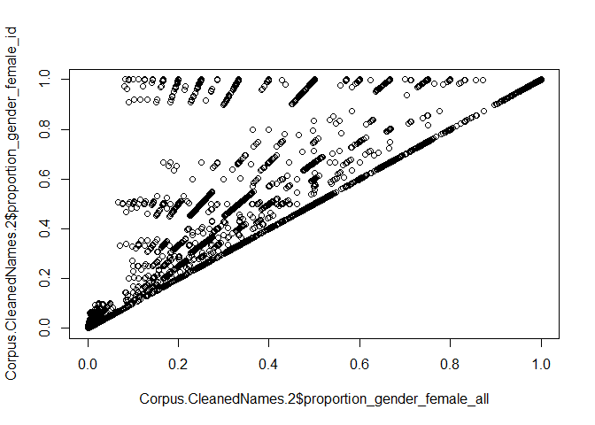<!-- -->

Sur la ligne à 45 degrés, nous avons les articles pour lesquels tous les auteurs ont un genre qui est identifié.
Et au dessus de la ligne à 45 degrés, les articles pour lesquels certains auteurs n'ont pas de genre identifiés.

Analyse de l'assignation du genre à l'échelle de l'article : 

Il est aussi possible de faire l'analyse à partir de la variable "ratio_identified_gender", qui donne par article, le pourcentage d'auteurs dans le nb d'auteurs totale dont le genre est identifié


``` r
Gender_of_Articles <- Corpus.CleanedNames.2 %>% 
  summarize(Nb_articles = length(ratio_identified_gender), # Nb total d'article
            NoGender = length(ratio_identified_gender[is.na(ratio_identified_gender) | ratio_identified_gender == 0]) / Nb_articles, # Ratio d'articles avec aucun auteur dont le genre est identifié ou NA # Ratio d'article avec aucun auteur dont le genre est identifié : raouter valeurs manuntes
            AllGender = length(ratio_identified_gender[ratio_identified_gender == 1])/Nb_articles, # Ratio d'article où tous les auteurs sont identifiés
            Gender_Larger0.5 = length(ratio_identified_gender[ratio_identified_gender >= 0.5])/Nb_articles, # Ratio d'article où au moins 50% des auteurs sont identifiés
            Gender_Larger0.9 = length(ratio_identified_gender[ratio_identified_gender >= 0.9])/Nb_articles, # Ratio d'article où au moins 90% des auteurs sont identifiés
            Gender_Larger0.25 = length(ratio_identified_gender[ratio_identified_gender >= 0.25])/Nb_articles, # Ratio d'article où au moins 25% des auteurs sont identifiés
            Mean_IdentifiedGender = mean(ratio_identified_gender), # Moyenne du ratio d'auteurs identifé
            Median_identifiedGender = median(ratio_identified_gender))# Médiane

Gender_of_Articles
```

```
##   Nb_articles  NoGender AllGender Gender_Larger0.5 Gender_Larger0.9
## 1       59956 0.1558309 0.5485189        0.7726499        0.5493195
##   Gender_Larger0.25 Mean_IdentifiedGender Median_identifiedGender
## 1         0.8341617             0.7058209                       1
```

Nous voyons que pour environ 15% des articles, il nous est impossible d'assigner le genre à l'un des auteurs.
Pour plus de 50% des articles nous sommes capable d'identifer le genre de tous les auteurs.
Pour 75% des articles nous sommes capable d'assigner la moitié des auteurs.
Pour la moitié des articles nous sommes capable d'assigner le genre de 90% des auteurs.
Pour environ 80% des articles, nous pouvons assigner le genre de 25% des auteurs.

## Step 8 : Analyse de l'assignation du genre à l'échelle des auteurs : 


``` r
# Check 100 first authors without gender and most articles
NotGendered_authors <- authors_df %>% 
  filter(is.na(gender)) %>% 
  arrange(firstname)

NotGendered_authors #30 454 auteurs qui n'ont pas été assignés sur 111 116 auteurs différents (27% d'auteurs non assignés)
```

```
## # A tibble: 30,512 × 8
##    firstname lastname fullname                  fullname2 gender proportion_male
##    <chr>     <chr>    <chr>                     <chr>     <chr>            <dbl>
##  1 A         Aziz     Ab.Y. Aziz                " Aziz, … <NA>                NA
##  2 A         Karim    Ab.M.S. Karim             " Karim,… <NA>                NA
##  3 A         Kausar   A Rashid Kausar           " Kausar… <NA>                NA
##  4 A         Jung     A-Reum Jung               "Jung, A… <NA>                NA
##  5 A         Lucifero A Cura Di Nicola Lucifero "Lucifer… <NA>                NA
##  6 AG        Cariappa AG Adeeth Cariappa        "Cariapp… <NA>                NA
##  7 Aabgeena  Naeem    Aabgeena Naeem            " Naeem,… <NA>                NA
##  8 Aabroo    Mahal    Aabroo Mahal              " Mahal,… <NA>                NA
##  9 Aadhaar   Verma    Aadhaar Verma             " Verma,… <NA>                NA
## 10 Aaina     Rathore  Aaina Singh Rathore       " Rathor… <NA>                NA
## # ℹ 30,502 more rows
## # ℹ 2 more variables: proportion_female <dbl>, n_articles <int>
```

## Step 9 : Creation of categorical variables : 


``` r
#Création de variables binaires : sum_gender_male_bin est défini comme 1 si sum_gender_male est supérieur à 0, sinon 0 (il y a forcément 1 homme auteur), sum_gender_female_bin est défini comme 1 si sum_gender_female est supérieur à 0, sinon 0.
Corpus.CleanedNames.2 <- Corpus.CleanedNames.2 %>%
  mutate(
    sum_gender_male_bin = ifelse(sum_gender_male > 0, 1, 0),
    sum_gender_female_bin = ifelse(sum_gender_female > 0, 1, 0)
  )

#Création de la variable catégorielle category_gender
Corpus.CleanedNames.2 <- Corpus.CleanedNames.2 %>%
  mutate(
    category_gender = case_when(
      sum_gender_female_bin == 0 ~ "MM",
      sum_gender_male_bin == 0 ~ "FF",
      sum_gender_male_bin == 1 & sum_gender_female_bin == 1 ~ "MF"
    )
  )

# Vérification des résultats
table(Corpus.CleanedNames.2$category_gender)
```

```
## 
##    FF    MF    MM 
##  3570 35917 20469
```

# Step 10 : Descriptive Statistics

First step : determine the absolute number of articles with at least 1 author identified in terms of gender with NoGender 


``` r
OneGender_by_Articles <- Corpus.CleanedNames.2 %>% 
  summarize(Nb_articles = length(ratio_identified_gender), # Nb total d'article
            NoGender = length(ratio_identified_gender[is.na(ratio_identified_gender) | ratio_identified_gender == 0]) / Nb_articles)

OneGender_by_Articles
```

```
##   Nb_articles  NoGender
## 1       59956 0.1558309
```
Il y a au moins 85% des articles dont le genre a été assigné à au moins un auteur. 

## 1. Study of the sum_gender_female variable at an aggregate level


``` r
library(ggplot2)
```

### 1.1. Proportion of male and female authors

### 1.1.1. Descriptive statitistics : Proportion of male and female authors at an aggregate level


``` r
#amélioration de ton code pour faire un tableau unique 
# Charger les packages nécessaires
library(dplyr)
library(knitr)

# Calcul des statistiques descriptives
stats_proportion_female_all <- summary(Corpus.CleanedNames.2$proportion_gender_female_all)
stats_proportion_female_id <- summary(Corpus.CleanedNames.2$proportion_gender_female_id)
stats_sum_gender_female <- summary(Corpus.CleanedNames.2$sum_gender_female)
stats_sum_gender_male <- summary(Corpus.CleanedNames.2$sum_gender_male)
stats_proportion_male_all <- summary(Corpus.CleanedNames.2$proportion_gender_male_all)
stats_proportion_male_id <- summary(Corpus.CleanedNames.2$proportion_gender_male_id)

# Extraire les valeurs des statistiques descriptives
extract_summary <- function(summary_obj) {
  c(summary_obj["Min."], summary_obj["1st Qu."], summary_obj["Median"], summary_obj["Mean"], summary_obj["3rd Qu."], summary_obj["Max."])
}

# Créer un tableau de données avec les valeurs extraites
results_table <- data.frame(
  Statistic = c("Min", "1st Qu.", "Median", "Mean", "3rd Qu.", "Max"),
  Proportion_Female_All = extract_summary(stats_proportion_female_all),
  Proportion_Female_Id = extract_summary(stats_proportion_female_id),
  Sum_Gender_Female = extract_summary(stats_sum_gender_female),
  Sum_Gender_Male = extract_summary(stats_sum_gender_male),
  Proportion_Male_All = extract_summary(stats_proportion_male_all),
  Proportion_Male_Id = extract_summary(stats_proportion_male_id)
)

results_table
```

```
##         Statistic Proportion_Female_All Proportion_Female_Id Sum_Gender_Female
## Min.          Min             0.0000000            0.0000000         0.0000000
## 1st Qu.   1st Qu.             0.0000000            0.0015000         0.0000000
## Median     Median             0.0039000            0.0079000         0.0064000
## Mean         Mean             0.2046054            0.2927991         0.5132981
## 3rd Qu.   3rd Qu.             0.3356333            0.5010833         1.0000000
## Max.          Max             1.0000000            1.0000000         8.9975000
##         Sum_Gender_Male Proportion_Male_All Proportion_Male_Id
## Min.           0.000000           0.0000000          0.0000000
## 1st Qu.        0.003100           0.0021250          0.4989167
## Median         1.000000           0.5000000          0.9921000
## Mean           1.157177           0.5012266          0.7072271
## 3rd Qu.        1.992200           0.9947000          0.9985000
## Max.          11.981900           1.0000000          1.0000000
```
En moyenne, parmi tous les auteurs, il y a 20% de femmes par article.
La part d'auteur femme en moyenne est de 30% (en mesurant la part parmi les auteurs dont le genre est identifié, par article).

Le summary avec female nous dit qu'il y a 0.5 femmes auteurs par article.
La médiane est intéressante: il y a 50% des articles qui sont rédigés sans auteur femme.
Et le 3e quartile nous dit que 25% des articles ont une auteur qui est une femme.

Le summary avec male nous dit qu'il y a 1.1 hommes auteurs par article.
La médiane nous dit qu'au moins 50% des articles ont un auteur homme.
Et Le 3e quartile nous dit que 25% des articles ont deux auteurs hommes.

En moyenne 30% et 70% de femmes parmi les auteurs dont le genre a été identifié.

### 1.1.2. Graphics : Proportion of male and female authors at an aggregate level


``` r
hist(Corpus.CleanedNames.2$proportion_gender_male_id, main="Distribution de la proportion d'hommes", xlab="Proportion d'hommes", col="blue", breaks=20)
```

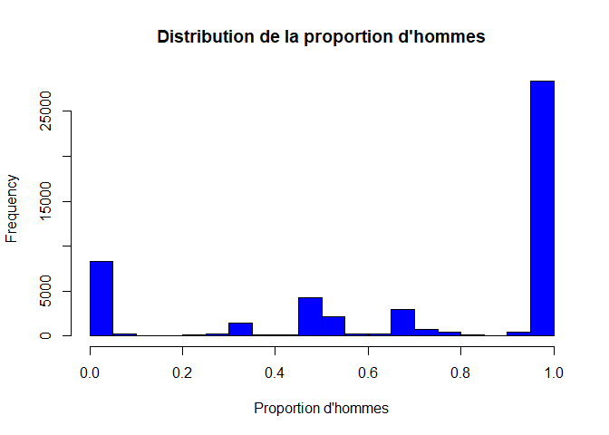<!-- -->

``` r
hist(Corpus.CleanedNames.2$proportion_gender_female_id, main="Distribution de la proportion de femmes", xlab="Proportion de femmes", col="pink", breaks=20)
```

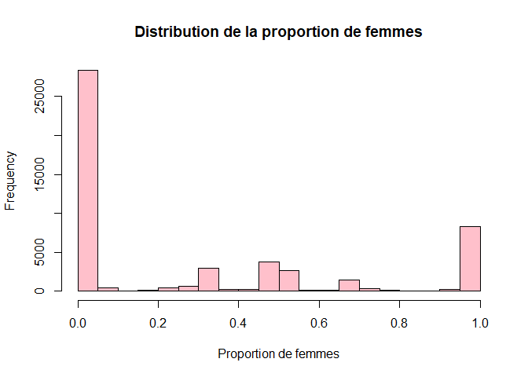<!-- -->
- Distribution de femmes : la distribution est centrée vers la gauche donc beaucoup d'articles avec aucune femme (+ de 2500) avec très peu de valeurs au milieu de la distirbution et moins d'articles avec seulement des femmes (environ 10 000)
- Distribution d'hommes : la distribution est centrée vers la droite donc beaucoup d'articles que des hommes (+ de 2500) avec très peu de valeurs au milieu de la distirbution et moins d'articles avec aucun homme (environ 8 000)
- Peu de collaboration car peu de valeurs centrées


``` r
#Distribution of sum_gender_male : bar chart

#ggplot(data = Corpus.Short, mapping = aes(x = sum_gender_male)) + geom_bar() + labs(title = "Distribution of male authors per article", subtitle = "Bar Chart",x = "Number of male authors", y = "Number of articles") + scale_x_continuous(breaks = seq(0, 10, by = 1), limits = c(0, 10))

##Distribution of sum_gender_female : bar chart

#ggplot(data = Corpus.Short, mapping = aes(x = sum_gender_female)) + geom_bar() + labs(title = "Distribution of female authors per article", subtitle = "Bar Chart", x = "Number of female authors", y = "Number of articles") + scale_x_continuous(breaks = seq(0, 10, by = 1), limits = c(0, 10))

#Distribution of sum_gender_male : density graph
#ggplot(Corpus.Short, aes(x = sum_gender_male)) + geom_density(linewidth = 0.75) + labs( title = "Distribution of male authors per article", subtitle = "Density Graph", x = "Number of male authors", y = "Density") + scale_x_continuous(breaks = seq(0, 10, by = 1), limits = c(0, 10))

#ggplot(Corpus.Short, aes(x = sum_gender_female)) + geom_density(linewidth = 0.75) + labs(title = "Distribution of female authors per article", subtitle = "Density Graph", x = "Number of female authors", y = "Density") + scale_x_continuous(breaks = seq(0, 10, by = 1), limits = c(0, 10))
```

### 1.2. Proportion of female and male authors according to categorical variables

### 1.2.1 Descriptive statistics: Proportion of female and male authors according to categorical variables


``` r
stats_by_category <- Corpus.CleanedNames.2 %>%
  group_by(category_gender) %>%
  summarize(
    Mean_Proportion_Female_Id = mean(proportion_gender_female_id, na.rm = TRUE),
    Median_Proportion_Female_Id = median(proportion_gender_female_id, na.rm = TRUE),
    Mean_Proportion_Male_Id = mean(proportion_gender_male_id, na.rm = TRUE),
    Median_Proportion_Male_Id = median(proportion_gender_male_id, na.rm = TRUE),
  )
stats_by_category
```

```
## # A tibble: 3 × 5
##   category_gender Mean_Proportion_Female_Id Median_Proportion_Female_Id
##   <chr>                               <dbl>                       <dbl>
## 1 FF                                  1                           1    
## 2 MF                                  0.313                       0.206
## 3 MM                                  0                           0    
## # ℹ 2 more variables: Mean_Proportion_Male_Id <dbl>,
## #   Median_Proportion_Male_Id <dbl>
```
- Catégorie FF : moyenne et médiane de 100% de femmes (logique)
- Catégorie MM : moyenne et médiane de 100% d'hommes (logique)
- Catégorie MF : 30% de femmes en moyenne pour les articles collaboratifs et 70% d'hommes

### 1.2.2 Graphics : Proportion of female and male authors according to categorical variables


``` r
stats_long <- stats_by_category %>%
  pivot_longer(cols = c(Mean_Proportion_Female_Id, Mean_Proportion_Male_Id), #colonne que l'on veut mettre en format long = moyennes
               names_to = "Gender", #nouvelle colonne intitulée "Gender"
               values_to = "Proportion") %>% #valeurs dans une nouvelle colonne intitulée "Proportion"
  mutate(Gender = ifelse(Gender == "Mean_Proportion_Female_Id", "Female", "Male")) #Si Gender est égal à "Mean_Proportion_Female_Id", alors nous remplaçons cette valeur par "Female". Si Gender est égal à "Mean_Proportion_Male_Id", alors nous remplaçons cette valeur par "Male".

# Créer le graphique
ggplot(stats_long, aes(x = category_gender, y = Proportion, fill = Gender)) +
  geom_bar(stat = "identity", position = "dodge") +
  labs(title = "Proportion of Female and Male Authors According to Categorical Variables",
       x = "Gender Category",
       y = "Mean Proportion",
       fill = "Gender") +
  theme_minimal()
```

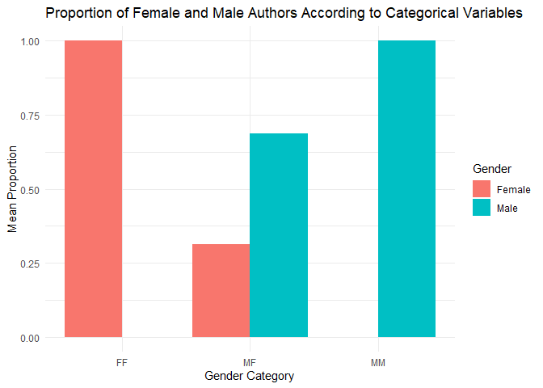<!-- -->
On retrouve les résultats des statistiques descriptives avec environ 30% de femmes et 70% d'homems pour les articles collaboratifs. 


``` r
#library(ggridges)
#Numerical and categorical variable
#ggplot(Corpus.Short, aes(x=sum_gender_male, y=category, fill=category, color=category)) + geom_density_ridges(alpha=0.5)

#ggplot(Corpus.Short, aes(x=category, y=proportion_gender_male)) + geom_boxplot()

#ggplot(Corpus.Short, aes(x=category, y=proportion_female)) + geom_boxplot()
```

### 1.3.Overall Temporal evolution

### 1.3.1. Descriptive statistics : overall temporal evolution


``` r
annual_stats <- Corpus.CleanedNames.2 %>%
  group_by(PY) %>%
  summarize(
    Mean_Proportion_Female_Id = mean(proportion_gender_female_id, na.rm = TRUE),
    Mean_Proportion_Male_Id = mean(proportion_gender_male_id, na.rm = TRUE)
  )
annual_stats
```

```
## # A tibble: 13 × 3
##       PY Mean_Proportion_Female_Id Mean_Proportion_Male_Id
##    <dbl>                     <dbl>                   <dbl>
##  1  2011                     0.253                   0.747
##  2  2012                     0.257                   0.743
##  3  2013                     0.258                   0.742
##  4  2014                     0.266                   0.734
##  5  2015                     0.294                   0.707
##  6  2016                     0.300                   0.700
##  7  2017                     0.299                   0.701
##  8  2018                     0.301                   0.699
##  9  2019                     0.309                   0.691
## 10  2020                     0.315                   0.685
## 11  2021                     0.308                   0.693
## 12  2022                     0.314                   0.686
## 13  2023                     0.263                   0.737
```
La proportion moyenne de femmes dans les articles publiés semble augmenter progressivement, d'environ 24,39% en 2011 à environ 33,17% en 2020.
En parallèle, la proportion moyenne d'hommes diminue légèrement sur la même période, passant d'environ 75,61% en 2011 à environ 66,83% en 2020.
Evolution vers une plus grande diversité de genres dans les publications au fil du temps, avec une augmentation de la représentation des femmes dans les articles

### 1.3.2. Graphics : overall temporal evolution


``` r
annual_stats_long <- annual_stats %>%
  pivot_longer(
    cols = c(Mean_Proportion_Female_Id, Mean_Proportion_Male_Id),
    names_to = "Gender",
    values_to = "Proportion"
  ) %>%
  mutate(Gender = ifelse(Gender == "Mean_Proportion_Female_Id", "Female", "Male"))

# Créer le graphique
ggplot(annual_stats_long, aes(x = PY, y = Proportion, color = Gender)) +
  geom_line(linewidth = 1) +
  labs(title = "Evolution of Gender Proportions Over Time",
       x = "Publication Year",
       y = "Mean Proportion",
       color = "Gender") +
  theme_minimal()
```

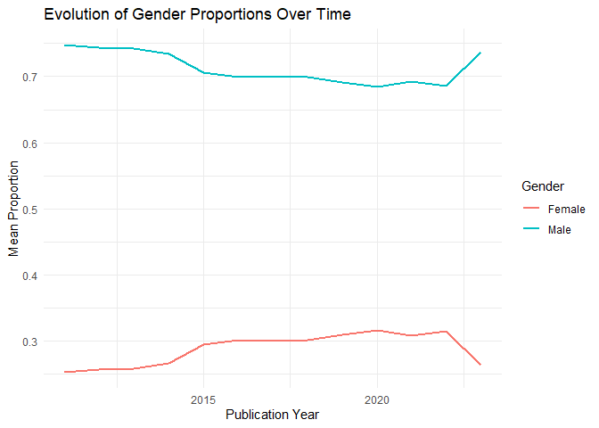<!-- -->


``` r
# Distribution of female authors accross time
#ggplot(Corpus.Short, aes(x = PY, y = sum_gender_female)) + geom_point() + labs(title = "Proportion of female authors across time", x = "Publication date", y = "Proportion") + scale_y_continuous(breaks = seq(0, 20, by = 1), limits = c(0, 20))

#ggplot(Corpus.Short, aes(x = PY, y = proportion_gender_male)) + geom_point() + labs(title = "Proportion of male authors across time", x = "Publication date", y = "Proportion") + scale_y_continuous(breaks = seq(0, 1, by = 0.1), limits = c(0, 1))
```

### 1.4. Temporal evolution according to categorical variables

### 1.4.1. Descriptive statistics : temporal evolution according to categorical variables


``` r
# Calculer les moyennes annuelles des proportions de genres par catégorie de genre
# Calculer les moyennes annuelles des proportions de genres par catégorie de genre
annual_stats_by_category <- Corpus.CleanedNames.2 %>%
  group_by(PY, category_gender) %>%
  summarize(
    Mean_Proportion_Female_Id = mean(proportion_gender_female_id, na.rm = TRUE),
    Mean_Proportion_Male_Id = mean(proportion_gender_male_id, na.rm = TRUE),
    .groups = 'drop' #`summarise()` has grouped output by 'PY'. You can override using the `.groups` argument.
  )

annual_stats_by_category
```

```
## # A tibble: 38 × 4
##       PY category_gender Mean_Proportion_Female_Id Mean_Proportion_Male_Id
##    <dbl> <chr>                               <dbl>                   <dbl>
##  1  2011 FF                                  1                       0    
##  2  2011 MF                                  0.276                   0.724
##  3  2011 MM                                  0                       1    
##  4  2012 FF                                  1                       0    
##  5  2012 MF                                  0.281                   0.719
##  6  2012 MM                                  0                       1    
##  7  2013 FF                                  1                       0    
##  8  2013 MF                                  0.269                   0.731
##  9  2013 MM                                  0                       1    
## 10  2014 FF                                  1                       0    
## # ℹ 28 more rows
```

``` r
# Restructurer les données pour ggplot2
annual_stats_by_category_long <- annual_stats_by_category %>%
  pivot_longer(
    cols = c(Mean_Proportion_Female_Id, Mean_Proportion_Male_Id),
    names_to = "Gender",
    values_to = "Proportion"
  ) %>%
  mutate(Gender = ifelse(Gender == "Mean_Proportion_Female_Id", "Female", "Male"))

# Créer le graphique
ggplot(annual_stats_by_category_long, aes(x = PY, y = Proportion, color = Gender)) +
  geom_line(size = 1) +
  facet_wrap(~ category_gender) +
  labs(title = "Evolution of Gender Proportions Over Time by Category",
       x = "Publication Year",
       y = "Mean Proportion",
       color = "Gender") +
  theme_minimal()
```

```
## Warning: Using `size` aesthetic for lines was deprecated in ggplot2 3.4.0.
## ℹ Please use `linewidth` instead.
## This warning is displayed once every 8 hours.
## Call `lifecycle::last_lifecycle_warnings()` to see where this warning was
## generated.
```

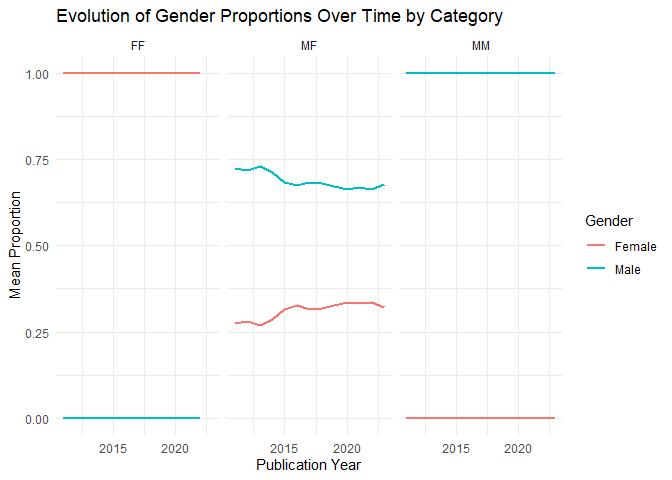<!-- -->
L'analyse de l'évolution temporelle de la proportion de femmes dans les collaborations mixtes (MF) montre une tendance à la hausse, bien que légèrement variable d'une année à l'autre. En 2011, la proportion moyenne de femmes dans les collaborations MF était d'environ 24,77%, et cette proportion a augmenté progressivement au fil des années pour atteindre environ 31,17% en 2020. 


### 1.4.2. Descriptive statistics : temporal evolution according to categorical variables,  by number of articles


``` r
annual_stats_by_category_nbarticles <- Corpus.CleanedNames.2 %>%
  group_by(PY, category_gender) %>%
  summarize(
    nb_articles=n()
    )
```

```
## `summarise()` has grouped output by 'PY'. You can override using the `.groups`
## argument.
```

``` r
annual_stats_by_category_nbarticles
```

```
## # A tibble: 38 × 3
## # Groups:   PY [13]
##       PY category_gender nb_articles
##    <dbl> <chr>                 <int>
##  1  2011 FF                      193
##  2  2011 MF                     2208
##  3  2011 MM                     1347
##  4  2012 FF                      175
##  5  2012 MF                     2406
##  6  2012 MM                     1305
##  7  2013 FF                      235
##  8  2013 MF                     2515
##  9  2013 MM                     1396
## 10  2014 FF                      233
## # ℹ 28 more rows
```


``` r
ggplot(annual_stats_by_category_nbarticles, aes(x = PY, y = nb_articles, color = category_gender, group = category_gender)) +
  geom_line(size = 1) +
  geom_point(size = 2) +
  labs(title = "Number of Articles by Year and Gender Category",
       x = "Publication Year",
       y = "Number of Articles",
       color = "Gender Category") +
  theme_minimal() +
  scale_y_continuous(expand = expansion(mult = c(0, 0.05)))
```

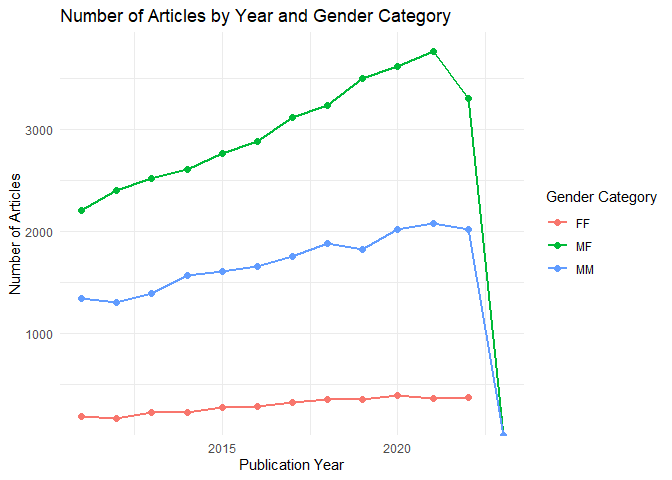<!-- -->

##2.Focus on climate change

# 2.1 Climate change overall : Descriptive statistics


``` r
# Calculer les statistiques descriptives pour chaque catégorie de la variable binaire "CC"
stats_by_CC <- Corpus.CleanedNames.2 %>%
  group_by(CC) %>%
  summarize(
    Mean_Proportion_Female_Id = mean(proportion_gender_female_id, na.rm = TRUE),
    Median_Proportion_Female_Id = median(proportion_gender_female_id, na.rm = TRUE),
    Mean_Proportion_Male_Id = mean(proportion_gender_male_id, na.rm = TRUE),
    Median_Proportion_Male_Id = median(proportion_gender_male_id, na.rm = TRUE)
  )

stats_by_CC
```

```
## # A tibble: 2 × 5
##      CC Mean_Proportion_Female_Id Median_Proportion_Fem…¹ Mean_Proportion_Male…²
##   <dbl>                     <dbl>                   <dbl>                  <dbl>
## 1     0                     0.292                 0.00775                  0.708
## 2     1                     0.301                 0.0348                   0.699
## # ℹ abbreviated names: ¹​Median_Proportion_Female_Id, ²​Mean_Proportion_Male_Id
## # ℹ 1 more variable: Median_Proportion_Male_Id <dbl>
```

``` r
# Conversion en format long
stats_long <- stats_by_CC %>%
  pivot_longer(cols = c(Mean_Proportion_Female_Id, Mean_Proportion_Male_Id),
               names_to = "Gender",
               values_to = "Proportion")

ggplot(stats_long, aes(x = factor(CC), y = Proportion, fill = Gender)) +
  geom_bar(stat = "identity", position = "dodge") +
  labs(title = "Proportion of Female and Male Authors by CC Category",
       x = "CC Category",
       y = "Mean Proportion",
       fill = "Gender") +
  scale_y_continuous(limits = c(0, 1)) +
  theme_minimal()
```

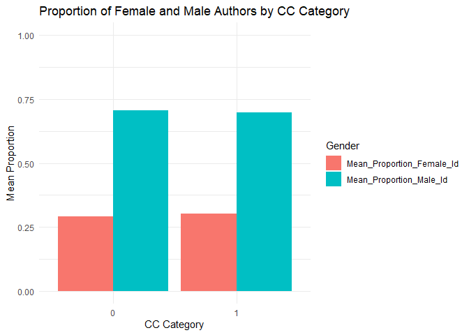<!-- -->
Interprétation : en moyenne, la proportion d'auteurs féminins dans les articles liés au changement climatique est légèrement plus faible que dans les articles non liés au changement climatique, avec des moyennes de 29,99% et 29,75% respectivement. En revanche, la proportion d'auteurs masculins est plus élevée dans les articles sur le changement climatique, avec une moyenne de 70,26%, comparativement à 70,06% pour les autres articles.

##2.2. Climate change, category gender and number of articles


``` r
stats_by_CC_category_gender <- Corpus.CleanedNames.2 %>%
  group_by(CC, category_gender) %>%
  summarize(nb_articles = n(), .groups = 'drop')

stats_by_CC_category_gender
```

```
## # A tibble: 6 × 3
##      CC category_gender nb_articles
##   <dbl> <chr>                 <int>
## 1     0 FF                     3432
## 2     0 MF                    34263
## 3     0 MM                    19764
## 4     1 FF                      138
## 5     1 MF                     1654
## 6     1 MM                      705
```


``` r
# Calculer la proportion des articles pour chaque combinaison de CC et category_gender
stats_by_CC_category_gender <- stats_by_CC_category_gender %>%
  group_by(CC) %>%
  mutate(proportion_articles = nb_articles / sum(nb_articles))

# Graphique
ggplot(stats_by_CC_category_gender, aes(x = factor(CC), y = proportion_articles, fill = category_gender)) +
  geom_bar(stat = "identity", position = "dodge") +
  labs(title = "Proportion of Articles by Collaboration Type and Climate Change Relevance",
       x = "Climate Change Relevance (CC)",
       y = "Proportion of Articles",
       fill = "Collaboration Type") +
  theme_minimal()
```

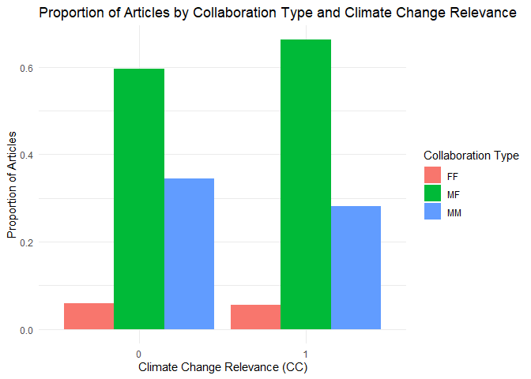<!-- -->

## 2.3 : Temporal evolution of the proportion of female authors by CC


``` r
annual_stats_by_CC <- Corpus.CleanedNames.2 %>%
  group_by(PY, CC) %>%
  summarize(
    Mean_Proportion_Female_Id = mean(proportion_gender_female_id, na.rm = TRUE),
    .groups = 'drop'
  )

annual_stats_by_CC
```

```
## # A tibble: 26 × 3
##       PY    CC Mean_Proportion_Female_Id
##    <dbl> <dbl>                     <dbl>
##  1  2011     0                     0.252
##  2  2011     1                     0.268
##  3  2012     0                     0.254
##  4  2012     1                     0.325
##  5  2013     0                     0.256
##  6  2013     1                     0.316
##  7  2014     0                     0.265
##  8  2014     1                     0.302
##  9  2015     0                     0.296
## 10  2015     1                     0.225
## # ℹ 16 more rows
```

``` r
ggplot(annual_stats_by_CC, aes(x = PY, y = Mean_Proportion_Female_Id, color = factor(CC))) +
  geom_line(size = 1) +
  labs(title = "Evolution of Mean Proportion of Female Authors Over Time",
       x = "Publication Year",
       y = "Mean Proportion of Female Authors",
       color = "Climate Change Relevance (CC)") +
  theme_minimal() +
  scale_y_continuous(limits = c(0, 1)) # Ajuster les limites de l'ordonnée pour aller de 0 à 1
```

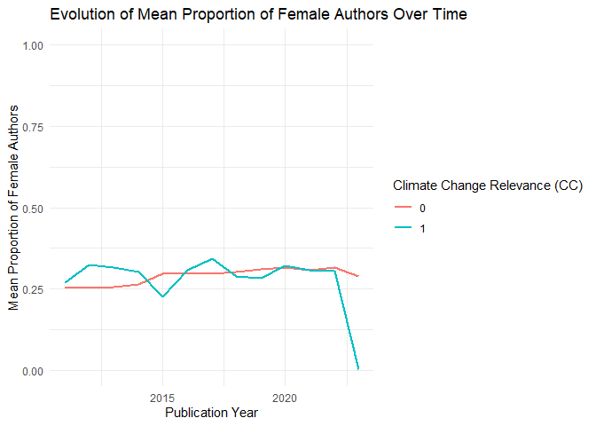<!-- -->
Increase of female authors regarding climate change articles and decrase for non climate change related articles

##3.Focus on Top5 and Top30 and on climte change


``` r
# Calculer les statistiques descriptives pour chaque combinaison de catégorie de journaux et de la variable binaire "CC"
stats_by_journal_CC <- Corpus.CleanedNames.2 %>%
  group_by(TopFive, Top30, CC) %>%
  summarize(
    Mean_Proportion_Female_Id = mean(proportion_gender_female_id, na.rm = TRUE),
    Median_Proportion_Female_Id = median(proportion_gender_female_id, na.rm = TRUE),
    Median_Proportion_Male_Id = median(proportion_gender_male_id, na.rm = TRUE),
    Mean_Proportion_Male_Id = mean(proportion_gender_male_id, na.rm = TRUE),
  )
```

```
## `summarise()` has grouped output by 'TopFive', 'Top30'. You can override using
## the `.groups` argument.
```

``` r
stats_by_journal_CC
```

```
## # A tibble: 6 × 7
## # Groups:   TopFive, Top30 [3]
##   TopFive Top30    CC Mean_Proportion_Female_Id Median_Proportion_Female_Id
##     <dbl> <dbl> <dbl>                     <dbl>                       <dbl>
## 1       0     0     0                    0.297                       0.008 
## 2       0     0     1                    0.304                       0.0386
## 3       0     1     0                    0.209                       0.0044
## 4       0     1     1                    0.200                       0.0037
## 5       1     1     0                    0.169                       0.0032
## 6       1     1     1                    0.0311                      0.0038
## # ℹ 2 more variables: Median_Proportion_Male_Id <dbl>,
## #   Mean_Proportion_Male_Id <dbl>
```

Moyenne et medianens différentes en raison des valeurs extrêmes (beaucoup d'articles où il n'y a pas de femmes / où il n'y a que des hommes)


``` r
ggplot(Corpus.CleanedNames.2, aes(x = factor(Top30), y = proportion_gender_female_id)) +
  geom_boxplot() +
  labs(title = "Proportion of Female Authors in Top 30 Journals",
       x = "Top 30 Journals",
       y = "Mean Proportion of Female Authors") +
  facet_wrap(~ CC, scales = "free")
```

```
## Warning: Removed 9343 rows containing non-finite outside the scale range
## (`stat_boxplot()`).
```

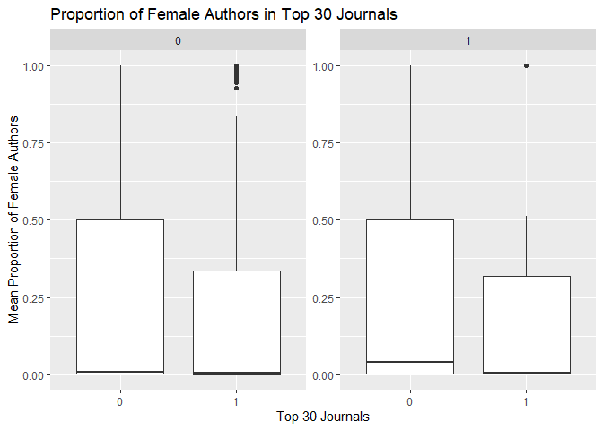<!-- -->

``` r
ggplot(Corpus.CleanedNames.2, aes(x = factor(Top30), y =proportion_gender_male_id)) +
  geom_boxplot() +
  labs(title = "Proportion of Male Authors in Top 30 Journals",
       x = "Top 30 Journals",
       y = "Mean Proportion of Female Authors") +
  facet_wrap(~ CC, scales = "free")
```

```
## Warning: Removed 9343 rows containing non-finite outside the scale range
## (`stat_boxplot()`).
```

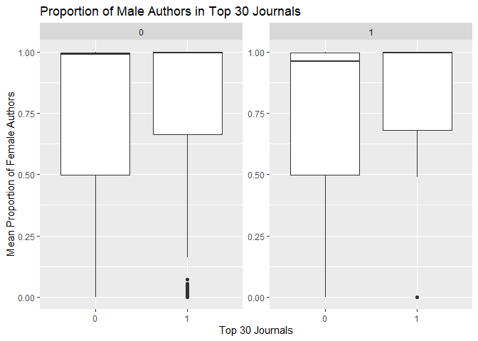<!-- -->
Articles qui portent sur le CC : la proportion de femme dans le top 30 est beaucoup plus grande 
Articles qui portent sur le CC et qui ne sont pas dans le top 30 : mediane de la proportion de femmes un peu plus élevée

## 2. Geography 

Affiliation data `C1`and `RP` variables.
We'd like to identify each countries in which authors of the articles are affiliated.
Thus, we'd like to create a variable "country" which list each country referenced in the `C1`and `RP`variables.


``` r
# table(Corpus$CC)
table(Corpus.Short$CC)
```

```
## 
##      0      1 
## 581500  25452
```

## Citation data

### Clean citation data

Prepare citation data.
We want to create a database, where for each article (one raw in `Corpus`), we have a data frame with its cited articles.
(one raw by references).
We want to separate information on the authors of the cited articles, the title of the article, the year of publication, and the journal.

First work with one of the datasource: let's say Wos.


``` r
gc()
```

```
##             used   (Mb) gc trigger   (Mb)  max used   (Mb)
## Ncells  18094612  966.4   35568961 1899.6  35568961 1899.6
## Vcells 350200728 2671.9  534842733 4080.6 445604606 3399.7
```

``` r
load(here(dir$raw.data,"Wos_Short.Rdata"))
head(Wos.Econ.Short$CR)
```

```
## [1] "Apostolato I.-A., 2013, INT REV SOCIAL RES, V3, DOI [10.1515/irsr-2013-0023, DOI 10.1515/IRSR-2013-0023]; Aynaud, 2013, GRAPH PARTITIONING, P315, DOI [10.1002/9781118601181.ch13, DOI 10.1002/9781118601181.CH13]; Baron J., 2019, JRC SCI POLICY REPOR; Baron J, 2018, J ECON MANAGE STRAT, V27, P462, DOI 10.1111/jems.12257; Baron J, 2013, J COMPET LAW ECON, V9, P905, DOI 10.1093/joclec/nht034; Batagelj V, 2004, MATH VIS, P77; Bekkers R, 2012, TECHNOL FORECAST SOC, V79, P1192, DOI 10.1016/j.techfore.2012.01.009; Bekkers R, 2011, RES POLICY, V40, P1001, DOI 10.1016/j.respol.2011.05.004; Blind K., 2003, Netnomics, V5, P71, DOI 10.1023/A:1024950302713; Blondel VD, 2008, J STAT MECH-THEORY E, DOI 10.1088/1742-5468/2008/10/P10008; Braveman B., 2013, STANDARD SETTI UNPUB; Burt RS, 1992, STRUCTURAL HOLES SOC; Chiao B, 2007, RAND J ECON, V38, P905, DOI 10.1111/j.0741-6261.2007.00118.x; Clarkson, 2004, THESIS HARVARD BUSIN; Contreras J.L., 2017, CAMBRIDGE HDB TECHNI; Contreras JL, 2019, RES HANDB LAW ECON, P185; De Nooy W., 2018, EXPLORATORY SOCIAL N; Epstein RA, 2013, COMPET POLICY INT, V9, P69; FARRELL J, 1988, RAND J ECON, V19, P235, DOI 10.2307/2555702; Farrell J, 2007, ANTITRUST LAW J, V74, P603; FREEMAN LC, 1979, SOC NETWORKS, V1, P215, DOI 10.1016/0378-8733(78)90021-7; Gmati H, 2019, PROCEDIA COMPUT SCI, V159, P313, DOI 10.1016/j.procs.2019.09.186; Goel RK, 2020, Q REV ECON FINANC, V76, P97, DOI 10.1016/j.qref.2019.03.006; Goel RK, 2020, J TECHNOL TRANSFER, V45, P481, DOI 10.1007/s10961-018-9708-y; Goel RK, 2009, J TECHNOL TRANSFER, V34, P637, DOI 10.1007/s10961-009-9119-1; GOEL RK, 2002, ECON INTEGRATION, V55, P17; Jiang JM, 2019, J TECHNOL TRANSFER, V44, P1070, DOI 10.1007/s10961-017-9645-1; KINDLEBERGER CP, 1983, KYKLOS, V36, P377, DOI 10.1111/j.1467-6435.1983.tb02705.x; LANCICHINETTI A, 2009, PHYS REV E 2, V80, DOI DOI 10.1103/PHYSREVE.80.056117; Lerner J, 2006, AM ECON REV, V96, P1091, DOI 10.1257/aer.96.4.1091; Lerner J, 2015, J POLIT ECON, V123, P547, DOI 10.1086/680995; Leydesdorff L, 2006, J AM SOC INF SCI TEC, V57, P1616, DOI 10.1002/asi.20335; Lusher D., 2013, EXPONENTIAL RANDOM G; Maskus K., 2014, PATENT CHALLENGES ST, DOI 10.17226/18510; Newman MEJ, 2004, PHYS REV E, V70, DOI [10.1103/PhysRevE.70.056131, 10.1103/PhysRevE.69.026113]; Rotta R., 2011, J EXP ALGORITHMICS, V16, p2.1, DOI DOI 10.1145/1963190.1970376; Schmoch U., 2003, CONTRACT N HPV2 CT 2; Scotchmer S., 2004, INNOVATION INCENTIVE; Spulber DF, 2019, ECON J, V129, P1477, DOI 10.1111/ecoj.12606; Updegrove A., 2012, S MAN INT PROP STAND; Wolfe AW, 1997, AM ETHNOL, V24, P219, DOI 10.1525/ae.1997.24.1.219; Wooldridge JM, 2010, ECONOMETRIC ANALYSIS OF CROSS SECTION AND PANEL DATA, 2ND EDITION, P3"
## [2] "Baldwin J. R., 2000, FAILURE RATES NEW CA; Barber BM, 2001, Q J ECON, V116, P261, DOI 10.1162/003355301556400; Bernardo AE, 2001, J ECON MANAGE STRAT, V10, P301, DOI 10.1111/j.1430-9134.2001.00301.x; Brennan MJ, 1999, ECON NOTES, V28, P119; Brenner LA, 1996, ORGAN BEHAV HUM DEC, V65, P212, DOI 10.1006/obhd.1996.0021; Bureau of Labor Statistics, 2019, BUS EMPL DYN SURV; Chen J., 2018, ADV OPT MAT, V6, P1; COOPER AC, 1995, J BUS VENTURING, V10, P107, DOI 10.1016/0883-9026(94)00022-M; DeGroot MH, 2004, OPTIMAL STAT DECISIO; Denrell J, 2003, ORGAN SCI, V14, P227, DOI 10.1287/orsc.14.3.227.15164; DUNNE T, 1989, J LABOR ECON, V7, P48, DOI 10.1086/298198; Hamilton BH, 2000, J POLIT ECON, V108, P604, DOI 10.1086/262131; Horvath M, 2001, INT J IND ORGAN, V19, P1023, DOI 10.1016/S0167-7187(01)00062-5; KAHNEMAN D, 1973, PSYCHOL REV, V80, P237, DOI 10.1037/h0034747; KIHLSTROM RE, 1979, J POLIT ECON, V87, P719, DOI 10.1086/260790; Klepper S, 2000, J POLIT ECON, V108, P728, DOI 10.1086/316100; Knight FH, 1921, RISK UNCERTAINTY PRO, P309; Lohrke FT, 2018, MANAGE DECIS, V56, P972, DOI 10.1108/MD-12-2016-0948; Lowe RA, 2006, MANAGE SCI, V52, P173, DOI 10.1287/mnsc.1050.0482; Puri M, 2007, J FINANC ECON, V86, P71, DOI 10.1016/j.jfineco.2006.09.003; Rabin M, 1998, J ECON LIT, V36, P11; Samuelson W., 1988, J RISK UNCERTAINTY, V1, P7, DOI DOI 10.1007/BF00055564; Schumpeter J., 1974, SOCIALISM DEMOCRACY; SELVIN S, 1976, ROY STAT SOC C-APP, V25, P8; Smith A., 2005, WEALTH NATIONS, P98; Thaler R., 1992, THE WINNERS CURSE; Van Den Steen E, 2004, AM ECON REV, V94, P1141, DOI 10.1257/0002828042002697"                                                                                                                                                                                                                                                                                                                                                                                                                                                                                                                                                                                                                                                                                                                                                                                                                                                                                                                                                                                                                                                                                                                                               
## [3] "Altera Invest, 2020, SAL READ MAD BUS FRA; [Anonymous], 2020, FRANCHISE CAPITAL; BURTON F, 2000, MANAGE INT REV, V40, P373; Combs JG, 1999, ACAD MANAGE J, V42, P196, DOI 10.2307/257092; CROSS J, 1995, HARVARD BUS REV, V73, P94; Franshiza.ru, 2020, CAT FRANCH; Gillis WE, 2020, J BUS VENTURING, V35, DOI 10.1016/j.jbusvent.2018.09.004; Gladilina I. P., 2019, INT J INNOVATIVE TEC, V9, P3892; International Franchise Association, 2020, OFF WEBS; Jang S, 2019, INT J HOSP MANAG, V76, P13, DOI 10.1016/j.ijhm.2018.06.004; Jerry D., 1999, COLLINS; Kang B, 2018, J SMALL BUS MANAGE, V56, P197, DOI 10.1111/jsbm.12404; Lafontaine F, 1999, J POLIT ECON, V107, P1041, DOI 10.1086/250090; Lapitskaya L., 2000, MARKETING, V3, P105; Laptev A. V., 2018, ESPACIOS, V39, P11; Lomakina N. A., 2020, LABOR SOCIAL RELATIO, V4, P36; Mayler A., 2003, BUSINESS EVERYONE, V10, P3; MILES RE, 1995, ORGAN DYN, V23, P5, DOI 10.1016/0090-2616(95)90013-6; Morkovina S. S., 2011, MECH NETWORK DEV ENT; Panyukova V. V., 2020, MARKETING RUSSIA ABR, V4, P58; REED SF, 1977, MERGERS ACQUISITIONS, V12, P4; Rosado-Serrano A, 2019, INT J RETAIL DISTRIB, V47, P752, DOI 10.1108/IJRDM-10-2018-0216; Sheresheva MY, 2006, ROSS ZH MENEDZH, V4, P55; Singer M.I., 1991, NONPROFIT MANAGEMENT, V1, P357; Sorokina I. O., 2009, FINANCE CREDIT, V378, P46; Spinelli S., 2007, FRANCHISING PATHWAY; Topfranchise, 2019, FRANCH WORLDW; Vargo SL, 2004, J MARKETING, V68, P1, DOI 10.1509/jmkg.68.1.1.24036; Vladimirova I. G., 1999, MANAGEMENT RUSSIA AB, V6, P15; Warren M., 2002, IEBM HDB MANAGEMENT; Watson A, 2020, IND MARKET MANAG, V89, P431, DOI 10.1016/j.indmarman.2020.03.005; WEBSTER FE, 1992, J MARKETING, V56, P1, DOI 10.2307/1251983"                                                                                                                                                                                                                                                                                                                                                                                                                                                                                                                                                                                                                                                                                                                                                                                                                                                                                                                                                                                                                                                      
## [4] "Ayanso A, 2014, INFORM TECHNOL DEV, V20, P60, DOI 10.1080/02681102.2013.797378; Polozhentseva Y, 2016, ECON ANN-XXI, V157, P15, DOI 10.21003/ea.V157-0004"                                                                                                                                                                                                                                                                                                                                                                                                                                                                                                                                                                                                                                                                                                                                                                                                                                                                                                                                                                                                                                                                                                                                                                                                                                                                                                                                                                                                                                                                                                                                                                                                                                                                                                                                                                                                                                                                                                                                                                                                                                                                                                                                                                                                                                                                                                                                                                                                                                                                                                                                                                                                                                                      
## [5] "Ain, 2020, MUCH FREEL EARN THEY; Amigud A, 2020, ASSESS EVAL HIGH EDU, V45, P541, DOI 10.1080/02602938.2019.1670780; Aseeva I., 2019, 34 INT BUS INF MAN A, P9679; Awdry R, 2019, HIGH EDUC, V78, P593, DOI 10.1007/s10734-019-00360-0; Birks M, 2020, INT J EDUC INTEGR, V16, DOI 10.1007/s40979-020-00055-5; Boev E., 2015, ASIAN SOCIAL SCI, V11, P328, DOI [10.5539/ass.v11n4p328, DOI 10.5539/ASS.V11N4P328]; Brimble M, 2005, AUST EDUC RES, V32, P19, DOI 10.1007/BF03216825; Byrne JA, 2020, FEBS LETT, V594, P583, DOI 10.1002/1873-3468.13747; Consultant, 2020, AV MONTHL WAG GEN RU; Curtis GJ, 2017, J ACAD ETHICS, V15, P115, DOI 10.1007/s10805-017-9278-x; Eaton S. E., 2019, ORTHOPAEDIC SURG CIT; Foltynek T, 2018, INT J EDUC INTEGR, V14, DOI 10.1007/s40979-018-0027-8; Ison DC, 2020, ONLINE LEARN, V24, P142, DOI 10.24059/olj.v24i2.2096; Johnson C, 2020, J ACAD ETHICS, V18, P105, DOI 10.1007/s10805-019-09358-w; Kalimullin T., 2006, WP4200602 HSE; Lancaster T., 2019, T LANCASTER BLOG POS; Lancaster T, 2020, INT J EDUC INTEGR, V16, DOI 10.1007/s40979-020-00053-7; Lancaster T, 2020, J ACAD ETHICS, V18, P115, DOI 10.1007/s10805-019-09357-x; Lancaster T, 2016, HANDBOOK OF ACADEMIC INTEGRITY, P639, DOI 10.1007/978-981-287-098-8_17; Matviychuk-Soskina N., 2016, PERSPECTIVES, V2, P85; Medway D, 2018, BRIT EDUC RES J, V44, P393, DOI 10.1002/berj.3335; Olenkova A., 2019, AVERAGE INCOME FREEL; Podgorny B., 2014, SOCIOLOGICAL STUDIES, V1, P40; Prostudenta, 2019, TOP 13 SIT REV IS BE; Ria.ru, 2020, MED SAL RUSS WAS 350; Shala S, 2020, INT J EDUC INTEGR, V16, DOI 10.1007/s40979-020-00061-7; Sivasubramaniam S, 2016, INT J EDUC INTEGR, V12, DOI 10.1007/s40979-016-0007-9; Wallace MJ, 2014, EDUC STUD-UK, V40, P233, DOI 10.1080/03055698.2014.889597"                                                                                                                                                                                                                                                                                                                                                                                                                                                                                                                                                                                                                                                                                                                                                                                                                                                                                                                                                                                                
## [6] "Ghodsi M, 2016, ESTIMATING IMPORTER; Ghodsi M., 2016, BILATERAL IMPORT ELA; Kee HL, 2009, ECON J, V119, P172; KENNEDY PE, 1981, AM ECON REV, V71, P801; SILVA JMS, 2006, REV ECON STAT, V88"
```

Test


``` r
table(is.na(Wos.Econ.Short$CR))
```

```
## 
##  FALSE   TRUE 
## 149184   4976
```

Test 2


``` r
table(is.na(Wos.Econ.Short$CR), Wos.Econ.Short$PY)
```

```
##        
##          2018  2019  2020  2021  2022  2023
##   FALSE 30163 31178 30738 31229 25774   102
##   TRUE   1463  1742   953   672   146     0
```
